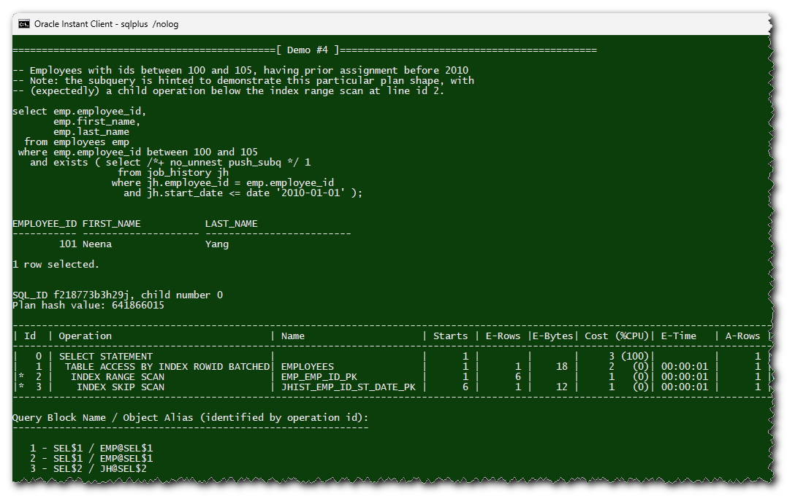

## SQL Plan demos

### Purpose

Scripts in this directory are intended for a live demo of common Oracle SQL plans:

* Run a simple SQL query in SQL\*Plus
* Show the corresponding plan
* Repeat...



### Prerequisites

#### Sample database schemas

The following Oracle sample schema(s) must be installed:

* HR

The [release 23.3](https://github.com/oracle-samples/db-sample-schemas/releases/tag/v23.3) of the DB sample schemas is expected.

#### Privileges

* READ/SELECT privileges on objects in the above-mentioned sample schemas
* DML privileges on objects in the sample schemas [^1]
* Enough privileges to use DBMS\_XPLAN.display\_cursor, and to query the following V$ views: [^2]
     * v$session
     * v$sql
     * v$sqlarea,
     * v$sqlcommand
     * v$sql\_plan
     * v$sql\_plan\_statistics\_all
     * v$parameter

[^1]: This is for demonstrating DML statements, such as UPDATE or MERGE. Everything should be rolled back, in principle.

[^2]: Typically (though not absolutely necessary) an account with SELECT\_CATALOG\_ROLE could be used.

### How to run the demos

```
% cd C:\path_to\...\demo

% sqlplus /nolog

SQL> connect demo_user@demo_db
Enter password: *******
Connected.

SQL> @demo_script
```

Where `demo_script` is one of the following:

* [`010-single_child.sql`](010-single_child.sql): this script demonstrates plan operations with a single child operation
* [`020-unrelated_combine.sql`](020-unrelated_combine): this script demonstrates plan operations in the _"unrelated-combine"_ category [^3]

And that's it.

[^3]: Per Christian Antognini's classification of plan operations, in [Troubleshooting Oracle Performance](https://antognini.ch/top/), 2nd Edition, chapter 10.

### License

Licensed under the [BSD Zero Clause License](https://spdx.org/licenses/0BSD.html).

